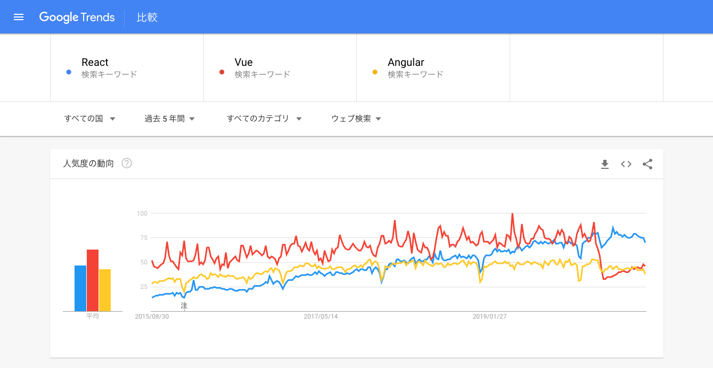

<!-- markdownlint-disable MD010 MD029 MD032 -->
# 『りあクト！ TypeScriptで始めるつらくないReact開発 第3版』の正誤表

最終更新日： 2020 年 11 月 13 日

- 正誤表の内容は随時アップデートされます。
- 誤りが判明した部分は、電子版については随時修正が反映された新しいバージョンが配信されます。購入先のサイトをご確認ください。

<br />

### 【Ⅰ. 言語・環境編】

- 1-1 / p.18 / 脚注6

```diff
  Google が開発するオープンソースの JavaScript エンジンであり、JIT
- コンパル
+ コンパイル
  （ソフトウェア実行時にコードのコンパイルを行う）を介して動作する仮想マシンの形を取る。
```

- 1-1 / p.24

```diff
  まず
- node <JavaScripファイル名>
+ node <JavaScriptファイル名>
  で、そのJavaScriptファイルのコードが実行される
```

- 1-1 / p.24 / 脚注21

```diff
- 「RLead-Eval-Print Loop」
+ 「Read-Eval-Print Loop」
  の略で、対話型の実行環境を意味する。
```

- 1-2 / p.32 / 見出し

```diff
- Crate
+ Create
  React Appで「Hello, World！」
```

- 1-2 / p.32

```diff
「……おおおお、たくさんパッケージがインストール
- されいきます」
+ されていきます」
```

- 2-1 / p.47

```diff
  といっても、秋谷さんは
- JavaScrpt
+ JavaScript
  での開発経験があるんだよね？」
```

- 2-3 / p.56

```diff
  扱うことができる最大値は
+ 2^53−1
  （9,007,199,254,740,991 ≒ 9千兆）。
```

- 2-6 / p.79

```diff
  実装面ではクラスベースより軽量にできるので、初期の貧弱な性能のブラウザで
- 動かすが必要のあった
+ 動かす必要があった
  ためにプロトタイプベースが採用されたのね。
```

- 2-7 / p.86

```diff
  React開発の文脈では文によって手続きを書き連ねていくスタイルではなく、
+ y = f(x) + w
  のような数学的な式を多用するスタイルがより好まれる。
```

- 2-8 / p.99

```diff
- ・ bind() で関数に this を束縛する
- ・ call() または apply() を使って this を指定して実行する
- ・ this の値を一時変数に代入する
- ・ アロー関数式で定義する
+ 1. bind() で関数に this を束縛する
+ 2. call() または apply() を使って this を指定して実行する
+ 3. this の値を一時変数に代入する
+ 4. アロー関数式で定義する
```

- 2-9 / p.106

```diff
 「ところがフロントエンド開発が
- 大規模する
+ 大規模化する
  につれ、
```

- 2-9 / p.111 / 脚注128

```diff
  Google が開発するオープンソースの JavaScript エンジンであり、JIT
- コンパル
+ コンパイル
  （ソフトウェア実行時にコードのコンパイルを行う）を介して動作する仮想マシンの形を取る。
```

- 3-1 / p.117

```diff
  まず基礎知識の確認からいこう。いま
- 当たり前のようにに
+ 当たり前のように
  使った用語だけれども、そもそも秋谷さんは
```

```diff
  数学の関数と同じものなんだよ。
+ y = f(x)
  ってアレね。
```

```diff
  プログラミングのパラダイムはまず大きく『命令型プログラミング（Imperative Programming）』
- って何を意味するんだと思う？」）
  』と『宣言型プログラミング（Declarative Programming）』の2つに大別される。
```

- 3-2 / p.120

```diff
  まず 1 から 100 の整数配列を作った上で、そこから
- 3
+ 8
  で割り切れるものだけを抜き出してるよね」
```

- 3-2 / p.124

```diff
- ・ 第1引数が第2引数より優先度が高い（前に来る）場合、-1 を返す
- ・ 第1引数が第2引数より優先度が低い（後に来る）場合、1 を返す
- ・ 第1引数と第2引数の優先度が同じ（ソートの必要がない）場合、0 を返す（※省略可）
+ ⅰ. 第1引数が第2引数より優先度が高い（前に来る）場合、-1 を返す
+ ⅱ. 第1引数が第2引数より優先度が低い（後に来る）場合、1 を返す
+ ⅲ. 第1引数と第2引数の優先度が同じ（ソートの必要がない）場合、0 を返す（※省略可）
```

- 3-3 / p.127

```diff
  values() と entries() が追加されたのは ES2017 と JavaScript の
- 使用
+ 仕様
  がある程度固まった後だった。
```

- 3-3 / p.129

```diff
- ・ 名前を持たないその場限りの関数（無名関数）を定義できる
- ・ 変数に関数を代入できる
- ・ 関数の引数として関数を渡したり、戻り値として関数を返すことができる（高階関数）
- ・ 関数に特定の引数を固定した新しい関数を作ることができる（部分適用）
- ・ 複数の高階関数を合成してひとつの関数にできる
+ ⅰ. 名前を持たないその場限りの関数（無名関数）を定義できる
+ ⅱ. 変数に関数を代入できる
+ ⅲ. 関数の引数として関数を渡したり、戻り値として関数を返すことができる（高階関数）
+ ⅳ. 関数に特定の引数を固定した新しい関数を作ることができる（部分適用）
+ ⅴ. 複数の高階関数を合成してひとつの関数にできる
```

- 3-3 / p.130

```diff
- const greeter = (target) => () => console.log(`Hi, ${target}!)`;
+ const greeter = (target) => () => console.log(`Hi, ${target}!`);
```

- 3-4 / p.136

```diff
  変数 he は if 文のブロックを外れたら誰からも
- 参照されるがこと
+ 参照されることが
  なくなる。
```

- 4-1 / p.145

```diff
  「JavaScript とそれによる関数型プログラミングの基本を
- 押さええた
+ 押さえた
  ところで、
```

- 4-3 / p.163

```diff
  引数と戻り値の型をそれぞれ定義するのではなく、
- React.FunctioComponent<P>
+ React.FunctionComponent<P>
  として提供されている関数の型を適用することが多いね」
```

- 4-5 / p.180

```diff
- リスト 78: 04-type-composition/non-null.json
+ リスト 78: 04-type-composition/non-null.ts
```

- 4-5 / p.186

```diff
- •	Ommit<T,K>
+ •	Omit<T,K>
  …… T から K が指定するキーのプロパティを省く
```

- 4-5 / p.182

```diff
  型推論で既存の変数から抜き出せるこの機能は、実際の開発の場
+ で
  はすごく重宝するよ。
```

- 4-5 / p.182

```diff
  実際には @babel/preset-typescript234 というプリセット（プラグインを特定のカテゴリー
+ によって
  まとめたもの）で TypeScript のコードから型情報を除去して
```

- 4-7 / p.201

```diff
  「ほんとだ。型エイリアスの
- Genre
+ Currency
  とオブジェクトの
- Genre
+ Currency
  、ひとつのインポート文でどちらも使えるようになってますね」
```

<br />

### 【Ⅱ. React 基礎編】

- 5-1 / p.2 / 図 3

以下の図に差し替え



- 5-1 / p.15

```diff
  MVCでは開発者の何の関心によって要素を分割している
+ かというと、アプリケーション横断的に技術の役割によって3つに分離してる
  」
  「ふーむ、まあそうですね」
- かというと、アプリケーション横断的に技術の役割によって3つに分離してる」
```

- 5-1 / p.20

```diff
  ・Display logic and markup are inevitably tightly coupled.
  （見た
- Z
  目のロジックとマークアップは必然的に分かちがたく結びついてる）
```

- 5-2 / p.40

```diff
  「ちなみに
- 『intrincic』
+ 『intrinsic』
  とは『本来備わっている、固有の』という意味ね。
```

- 6-2 / p.71

```diff
  　それから、.prettierrc というファイルを次の内容でプロジェクトルートに作成する」

- {#6-2-1-prettierrc caption=".prettierrc"} { "bracketSpacing": true, "printWidth": 80, "semi":
- true, "singleQuote": true, "trailingComma": 'all', "useTabs": false, }
+ {
+   "bracketSpacing": true,
+   "printWidth": 80,
+   "semi": true,
+   "singleQuote": true,
+   "trailingComma": 'all',
+   "useTabs": false,
+ }
```

- 7-1 / p.83

```diff
  この第 2 世代における三大フレームワークが Backbone.js と
- prototype.js、
+ Knockout、
  それに AngularJS ね。
```

- 8-1 / p.121

```diff
  これはよく言われることだけど、JavaScript の関数のようなものと考える
- と
  のが一番近い。
```

- 8-3 / p.138

```diff
- ・ state 内の変更したい要素名をキーに、値をその値にしたオブジェクト
+ ⅰ. state 内の変更したい要素名をキーに、値をその値にしたオブジェクト
  e.g. `{ count: 0 }`
- ・ `(prevState, props?) => newState` 形式の、以前の state と props を引数として受け取って新しい state を返す関数
+ ⅱ. `(prevState, props?) => newState` 形式の、以前の state と props を引数として受け取って新しい state を返す関数
  e.g. `(state, props) => ({ foo: state.foo + props.bar })`
```

- 8-4 / p.143

```diff
  ただし、この 2 の
- ライフシクルメソッド
+ ライフサイクルメソッド
  でそこに介入して、
```

- 8-4 / p.143-144 / 表
- 「2. Updatingフェーズ」

```diff
- shouldComponentUpdates(nextPprops, nextState)
+ shouldComponentUpdates(nextProps, nextState)

- getSnapShotBeforeUpdate(nextPprops, nextState)
+ getSnapShotBeforeUpdate(nextProps, nextState)

- componentDidUpdate(prevPprops, prevState, snapshot?)
+ componentDidUpdate(prevProps, prevState, snapshot?)
```

- 「4. Error Handlingフェーズ」`getDerivedStateFromError` 行

```diff
  子孫コンポーネントで例外が起きたときに呼ばれ、戻り値で新しい
- る
  state を設定できる
```

- 8-5 / p.150

```diff
- ・ デザインモックから始め、その UI をコンポーネントの構造に分解して落とし込む
- ・ ロジックを除外した、静的に動作するバージョンを作成する
- ・ UI を表現するために最低限必要な「状態」を特定する
- ・ 3 の「状態」をどこに配置すべきかを決める
- ・ 階層構造を逆のぼって考え、データが上階層から流れてくるようにする
+ 1. デザインモックから始め、その UI をコンポーネントの構造に分解して落とし込む
+ 2. ロジックを除外した、静的に動作するバージョンを作成する
+ 3. UI を表現するために最低限必要な「状態」を特定する
+ 4. 3 の「状態」をどこに配置すべきかを決める
+ 5. 階層構造を逆のぼって考え、データが上階層から流れてくるようにする
```

- 9-2 / p.168

```diff
  私の解釈ではコンポーネントに外から状態や
- そロジック
+ それらのロジック
  を紐付ける、つまり
```

- 9-3 / p.174

```diff
  関数
+ y = f(x)
  は本来なら
+ x
  が同じなら出力値
+ y
  も同じはずだけど、状態を抱える関数であれば必ずしもそうとは限らない。
  たとえば
+ f(1)
  は 2 を返していたのが任意の処理を実行することで、それ以降は
+ f(1)
  が 5 を返すようになる、これが副作用ということ。
```

- 9-3 / p.174

```diff
- ・実行されるタイミング
- ・propsとstateの値の即時性
- ・凝集の単位
+ 1. 実行されるタイミング
+ 2. propsとstateの値の即時性
+ 3. 凝集の単位
```

- 9-4 / p.186

```diff
    useEffect(() => {
-     if (timeLeft === 0) setTimeLeft(limit);
      if (timeLeft === 0) reset();
  -   }, [timeLeft, limit]);
  +   }, [timeLeft, reset]);
```

- 9-4 / p.189

```diff
  再レンダリングを伴わずに何らかのデータを関数コンポーネントで保存しておきたいケースというのがときどきあるのよ。
- 　さっきのカウントダウンタイマーだけど、実はまだ不備があってコンポーネントがアンマウントされたときだけじゃなく、props の limit が変更されたときも残り時間をリセットした上で以前の setInterval をクリアする必要がある。じゃないと、並行して新旧 2 つのカウントダウンタスクが走って挙動がおかしなことになってしまう」
- 「……ああー、言われてみれば。たしかにそうですよね」
- 「だから useRef を使ってタイマー ID を保持しておき、limit が変更されたらその ID でクリア処理を行うように Timer コンポーネントを修正してみよう」
+ 　たとえばさっきのカウントダウンタイマーだけど、実はまだ不備がある。props の limit が変更されたときには新しい limit の値でタイマーが初期化されるべきだよね。だからまずひとつめの useEffect の依存配列に limit を入れてあげないといけない」
+ 「たしかに。あれ？　でもそうすると limit が変わるたびに setInterval が呼ばれてタイマーの挙動がおかしなことになりませんか？」
+ 「そう。だから limit が変わったときの処理として、残り時間をリセットした上で以前のカウントダウンタスクをクリアする必要があるわけ。そこで useRef を使ってタイマー ID を保持しておき、limit が変更されたらその ID でクリア処理を行うの。こうすることで、たとえば最初のタイマーが開始後 10.99 秒のときに limit が 50 へ変更されたとして、再開後に 0.01 秒で 50→49 になってしまうような挙動も防げる」
+ 「ふむふむ、なるほど」
+ 「じゃ、今いったように Timer コンポーネントを修正してみよう」
```

<br />

### 【Ⅲ. React 応用編】

- 10-2 / p.17

```diff
  「んー、このあたりの経緯はちょっと入り組んでるんだよね。
- React Router
+ Reach Router
  は React Training という会社が提供してるんだけど、
```

- 脚注2

```diff
  「How we improved Gatsby’s accessibility in v2 by switching to @reach/router」
-  https://www.gatsbyjs.org/blog/2018-010-27-reach-router/
+  https://www.gatsbyjs.com/blog/2018-09-27-reach-router/
```

- 12-2 / p.119

```diff
- ・ 学習コストが高い
- ・ コードのボイラープレートが多い
- ・ storeの構造が過度に複雑化する
- ・ どのミドルウェアを使うかでコミュニティが分断され、ベストプラクティスが定まらない
+ ⅰ. 学習コストが高い
+ ⅱ. コードのボイラープレートが多い
+ ⅲ. storeの構造が過度に複雑化する
+ ⅳ. どのミドルウェアを使うかでコミュニティが分断され、ベストプラクティスが定まらない
```

- 12-3 / p.128

```diff
- Ract Hot Loader
+ React Hot Loader
  や Create React App の作者でもある彼は、もともと React エコシステムの DX を向上させたい思いが強かっただろうから、
```

- 12-3 / p.138

```diff
  ううん、
- Recoil が React の公式な状態管理ライブラリじゃないことは
+ 開発者としては Recoil が React の公式な状態管理ライブラリなのかって期待しちゃうけど、それは
  明確に否定されてる。
```

- 13-3 / p.152

```diff
  Apollo Client はバージョン 3.0 からパッケージ名が apollo-client から
- @react/apollo
+ @apollo/client
  に移行してるので、グラフはそのつもりで見てね
```

- 13-3 / p.176

```diff
- ・ Loading profile... をレンダリング（FCP）
- ・ ユーザーデータの取得を開始
- ・ ユーザーデータの取得が完了
- ・ ユーザー情報をレンダリング（FMP）
- ・ Loading posts... をレンダリング
- ・ 投稿データの取得を開始
- ・ 投稿データの取得が完了
- ・ 投稿情報をレンダリング（LCP）
+ 1. Loading profile... をレンダリング（FCP）
+ 2. ユーザーデータの取得を開始
+ 3. ユーザーデータの取得が完了
+ 4. ユーザー情報をレンダリング（FMP）
+ 5. Loading posts... をレンダリング
+ 6. 投稿データの取得を開始
+ 7. 投稿データの取得が完了
+ 8. 投稿情報をレンダリング（LCP）
```
