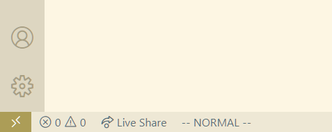
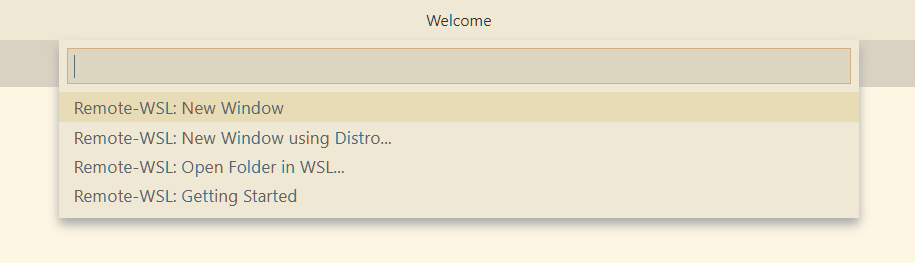
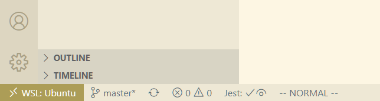
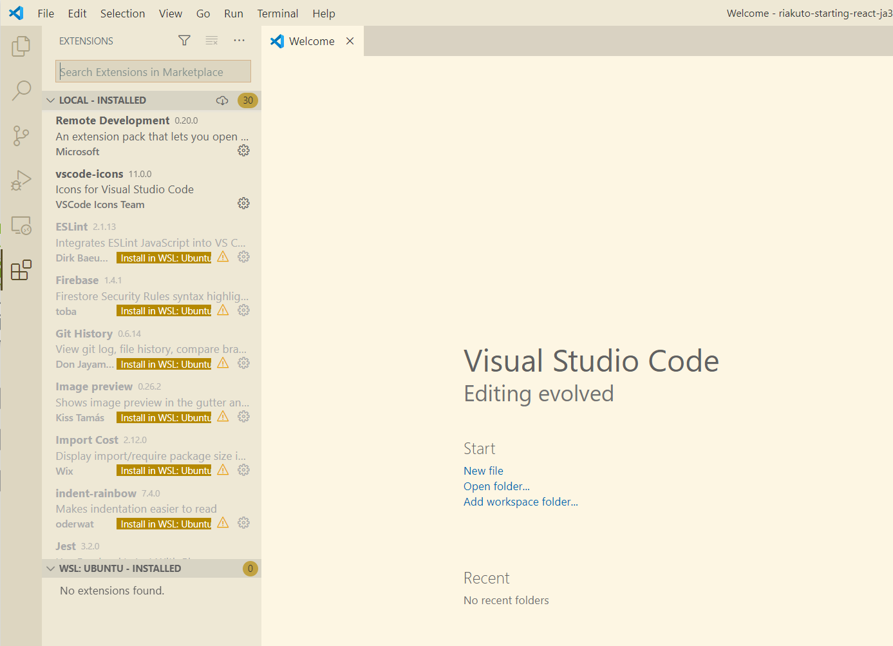

# Windows でフロントエンドの開発環境を作る手順

Windows に Node.js を直接インストールするのではなく、[WSL](https://docs.microsoft.com/ja-jp/windows/wsl/install-win10) で Ubuntu を入れてそこに必要な環境を作っていきます。

なお Windows 側にインストールするアプリはエディタとして Visual Studio Code、ターミナルとして Windows Terminal を使いますが、すでにインストールされている場合は手順を飛ばしてください。

## 1. WSL のインストールとアップグレード

参考：[Windows Subsystem for Linux (WSL) を Windows 10 にインストールする](https://docs.microsoft.com/ja-jp/windows/wsl/install-win10)

### WSL のインストール

- PowerShell を「管理者として実行」して開く
- 以下のコマンドを実行して WSL を有効にする

```powershell
dism.exe /online /enable-feature /featurename:Microsoft-Windows-Subsystem-Linux /all /norestart
```

### WSL2 へアップグレード

- 以下のコマンドを実行して仮想マシンの機能を有効にする

```powershell
dism.exe /online /enable-feature /featurename:VirtualMachinePlatform /all /norestart
```

- いったんマシンを再起動する
- [x64 マシン用 WSL2 Linux カーネル更新プログラム パッケージ（wsl_update_x64.msi）](https://wslstorestorage.blob.core.windows.net/wslblob/wsl_update_x64.msi)をダウンロードして実行する
- PowerShell を管理者権限で開いて以下のコマンドを実行し、WSL2 を規定のバージョンとして設定する

```powershell
wsl --set-default-version 2
```

## 2. Linux ディストリビューションをインストールする

### Ubuntu のインストール

- Microsoft Store から [Ubuntu](https://www.microsoft.com/ja-jp/p/ubuntu/9nblggh4msv6) をインストールする
- インストールした Ubuntu を起動。最初の起動時にユーザー名とパスワードを入力するよう促されるので、任意のものに設定する。ここで作成されたアカウントが管理者になる
- そのままでは WSL 環境で作られたファイルにすべて実行権限が付与されてしまうため、設定を変更する。以下の内容のファイルを `/etc/wsl.conf` として作成する

```shell
sudo vi /etc/wsl.conf
```

```conf
[automount]
options = "metadata,umask=22,fmask=11"
```

### 各種パッケージ

- Ubuntu のウィンドウで以下のコマンドを実行して、APT とインストール済みのパッケージを最新にする。さらに Git をインストールしておく

```shell
sudo apt update
sudo apt -y upgrade
sudo apt-get install -y git
```

- Bash 以外のシェルを使いたい場合は以下のようにする（ZSH の場合）

```shell
sudo apt-get install -y zsh
chsh -s /usr/bin/zsh
```

## 3. Windows Terminal をインストールする

- Microsoft Store で [Windows Terminal](https://www.microsoft.com/ja-jp/p/windows-terminal/9n0dx20hk701) をインストール
- Windows Terminal を起動、「設定」をクリックして設定ファイル `settings.json` を開く。以下のように編集して、デフォルトで WSL のタブが開きホームディレクトリで起動するに変更。なお各環境の GUID は同ファイル内の `"profiles" > "list"` 要素の `"guid"` に記述されている。

```diff
  {
    "$schema": "https://aka.ms/terminal-profiles-schema",

-   "defaultProfile": "{Windows PowerShell の GUID}",
+   "defaultProfile": "{Windows.Terminal.Wsl の GUID}",
  ︙
  "profiles":
  {
    "list":
    [
    ︙
      {
        "guid": "{Windows.Terminal.Wsl の GUID}",
        "hidden": false,
        "name": "Ubuntu",
        "source": "Windows.Terminal.Wsl",
+       "startingDirectory": "//wsl$/Ubuntu/home/ユーザー名"
```

## 4. Node.js のインストール

- anyenv のソースを取得

```shell
git clone https://github.com/anyenv/anyenv ~/.anyenv
```

- シェルに anyenv の設定を追加する（ZSH の場合）

```shell
echo 'eval "$(~/.anyenv/bin/anyenv init -)"' >> ~/.zshrc
```

- nodenv のインストール

```shell
exec $SHELL -l
anyenv install nodenv
exec $SHELL -l
```

- 以降は「1-1. 基本環境の構築」の「Node.js をインストールする」に沿って各種プラグインをインストールする

## 5. Visual Studio Code のインストールと設定

参考：[Windows Subsystem for Linux で VS Code の使用を開始する](https://docs.microsoft.com/ja-jp/windows/wsl/tutorials/wsl-VSCode)

### Visual Studio Code のインストール

- [公式サイトのダウンロードページ](https://code.visualstudio.com/download)から、 Visual Studio Code のインストーラをダウンロードして実行する

- スタートメニューから Visual Studio Code を起動し、`File > Prefenrence > Setting Sync` から GitHub アカウントまたは Microsoft アカウントで [Setting Sync](https://code.visualstudio.com/docs/editor/settings-sync) を有効にしておく

```
File > Prefenrence > Setting Sync
```

### WSL 上のプロジェクトを編集できるようにする

- VS Code で [Remote - WSL 拡張](https://marketplace.visualstudio.com/items?itemName=ms-VSCode-remote.remote-wsl)をインストールする

- VS Code を終了する

- Windows Terminal を開き、必要なパッケージをインストールして SSL 接続ができるようにする

```shell
sudo apt-get install -y wget ca-certificates
```

- 適当なプロジェクトをローカルに用意する

```shell
git clone git@github.com:oukayuka/Riakuto-StartingReact-ja3.1.git
```

- WSL 側からプロジェクトを VS Code で開く。すると初回起動時に必要なパッケージが自動的にインストールされ、 WSL 接続のための環境が作られる

```shell
cd ./Riakuto-StartingReact-ja3.1/01-hello/02-hello-world
code .
```

- 完了したら VS Code を終了し、もう一度スタートメニューから起動し直す。ウィンドウの左下に「Open a Remote Window」のアイコンが表示されているはずなのでそれをクリック



- ウィンドウ中央上に WSL 上のプロジェクトを開くための入力ボックスが開くので、「Remote-WSL: Open Folder in WSL...」を選択し、先ほどの `Riakuto-StartingReact-ja3.1.git/01-hello/02-hello-world` フォルダーを開く



- WSL の接続に成功すれば、左下のアイコン表示が「WSL: Ubuntu」のようになる



- VS Code 拡張には WSL 上で動作させるために WSL 側の環境にインストールの必要があるものも多い。ローカルにインストール済みで WSL 側にインストールする必要のあるものは「Install in WSL: Ubuntu️」というボタンが表示されるので、それをクリックすればインストールできる


